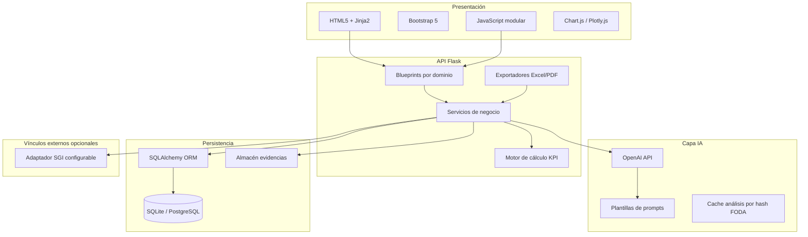
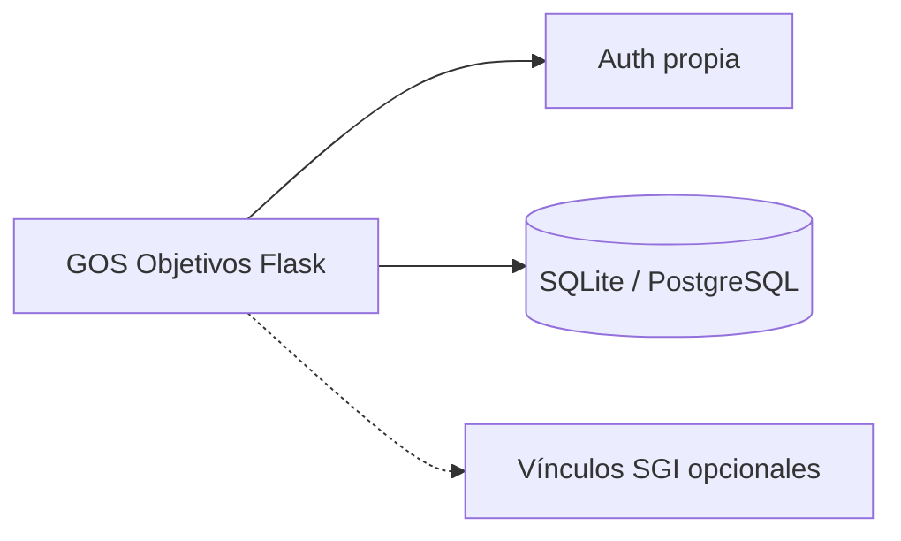

# 2. Arquitectura técnica

## 2.1 Vista de capas



## 2.2 Patrón arquitectónico

**Monolito modular Flask** (aplicación standalone):

- **Blueprints** por sección del menú (foda, objetivos, metas, kpi, seguimiento, dashboard, planes, reportes, config).
- **Servicios** (`services/`) con lógica de negocio; rutas delgadas.
- **Repositorios** opcionales (`repositories/`) si crece complejidad de consultas.
- **DTOs / schemas** con validación (Marshmallow o Pydantic v2 en capa API JSON).

No microservicios en v1: despliegue simple, transacciones locales, sesión Flask propia.

## 2.3 Stack tecnológico

| Capa | Tecnología | Notas |
|------|------------|-------|
| Frontend | HTML5, CSS3, Bootstrap 5, JS ES6+ | Sin framework SPA en v1; HTMX opcional en fase 3 |
| Backend | Python 3.11+, Flask 3.x | `create_app()` factory |
| ORM | SQLAlchemy 2.x | Migraciones Alembic |
| DB dev | SQLite | `DATABASE_URL` en `.env` |
| DB prod | PostgreSQL 15+ | Mismo modelo; tipos `JSONB` para metadata IA |
| Gráficos | Plotly (dashboards), Chart.js (widgets ligeros) | JSON desde API `/api/dashboard/*` |
| IA | OpenAI API (GPT-4o mini / configurable) | Timeout, reintentos, logging sin datos sensibles |
| PDF | WeasyPrint o ReportLab | Plantillas HTML → PDF |
| Excel | openpyxl | Export tabular FODA y seguimientos |
| Auth | Flask-Login (usuarios en BD) | Roles: admin, gerente, responsable, consulta |

## 2.4 API y contratos

### Rutas HTML (server-rendered)

Prefijo: `/planeamiento/`

| Prefijo blueprint | Ejemplo |
|-------------------|---------|
| `foda` | `/planeamiento/foda/` |
| `objetivos` | `/planeamiento/objetivos/` |
| … | … |

### API REST JSON (AJAX + gráficos)

Prefijo: `/planeamiento/api/v1/`

| Recurso | Métodos |
|---------|---------|
| `foda/items` | GET, POST, PUT, DELETE |
| `foda/analisis-ia` | POST (dispara análisis) |
| `objetivos` | CRUD + `POST .../aceptar-sugerencia` |
| `metas`, `kpis` | CRUD anidado |
| `seguimientos` | POST carga mensual |
| `dashboard/resumen` | GET agregados |
| `dashboard/graficos/{tipo}` | GET series |
| `ia/prediccion` | POST por objetivo o global |
| `planes-accion` | CRUD + auto-create hook |
| `sgi/vinculos` | GET, POST, DELETE |

Respuestas estándar:

```json
{
  "ok": true,
  "data": {},
  "meta": { "page": 1, "total": 100 },
  "errors": []
}
```

## 2.5 Motor de cálculo KPI

Reglas centralizadas en `services/kpi_calculator.py`:

| Métrica | Definición v1 |
|---------|----------------|
| Avance mensual | `(valor_real / valor_objetivo_kpi) * 100` cap 0–200% según tipo |
| Avance acumulado | Promedio ponderado o último acumulado según `tipo_agregacion` del KPI |
| Desvío | `valor_real - valor_objetivo` (o % según unidad) |
| Tendencia | Regresión lineal simple últimos N períodos (N configurable, default 6) |
| Semáforo | Verde ≥90%, Amarillo 70–89%, Rojo &lt;70% sobre cumplimiento global del KPI |

Fórmulas personalizadas: campo `formula` parseado de forma segura (AST limitado, sin `eval` libre) en fase 2; v1 soporta plantillas predefinidas + ratio simple.

## 2.6 Capa IA

### Flujos

1. **Análisis FODA**: entrada JSON de 4 listas → prompt con cruces FO/DO/FA/DA → salida estructurada JSON guardada en `foda_analisis_ia`.
2. **Objetivos sugeridos**: basado en análisis + categorías → lista en `objetivos_sugerencias` (estado pendiente hasta aceptar).
3. **Metas/KPI sugeridos**: por objetivo/meta aceptado.
4. **Predicción**: histórico `seguimientos` → probabilidad cumplimiento, texto recomendación.

### Buenas prácticas

- Variables de entorno: `OPENAI_API_KEY`, `OPENAI_MODEL`.
- Límite de tokens; truncar descripciones largas.
- Versionar prompts en `prompts/*.txt` o YAML.
- Registrar `prompt_version` y `model` en cada respuesta IA.
- Opción “modo demo” sin API (respuestas fixture) para desarrollo.

## 2.7 Seguridad y multi-empresa

- Todas las consultas filtradas por `empresa_id` de sesión.
- Evidencias: rutas fuera de `static`, servidas con control de permiso.
- Sanitización uploads (tipo MIME, tamaño máx).
- CSRF en formularios Flask-WTF.
- Rate limit en endpoints IA (Flask-Limiter).

## 2.8 Escalabilidad PostgreSQL

| Aspecto | SQLite (dev) | PostgreSQL (prod) |
|---------|--------------|-------------------|
| Conexión | `sqlite:///...` | `postgresql+psycopg2://...` |
| JSON | TEXT | JSONB para `analisis_json`, `metadata` |
| Concurrencia |单 escritor | Pool SQLAlchemy |
| Full-text | LIKE | `tsvector` opcional en descripciones FODA |

Migración: Alembic desde día 1; sin SQL específico SQLite en lógica de app.

## 2.9 Aplicación standalone



- Punto de entrada: `wsgi.py` / `flask run` con `create_app()`.
- Rutas bajo `/` (o prefijo configurable `URL_PREFIX=/`); no depende de shell externo.
- Assets en `/static/` con tema corporativo GOS (`--gos-primary` en `theme.css`).
- Login en `/auth/login`; dashboard en `/dashboard/` como home post-login.

## 2.10 Observabilidad

- Logging estructurado (módulo, empresa_id, usuario, acción).
- Tabla `auditoria_eventos` para cambios en objetivos y seguimientos.
- Health check: `GET /planeamiento/api/v1/health`.
