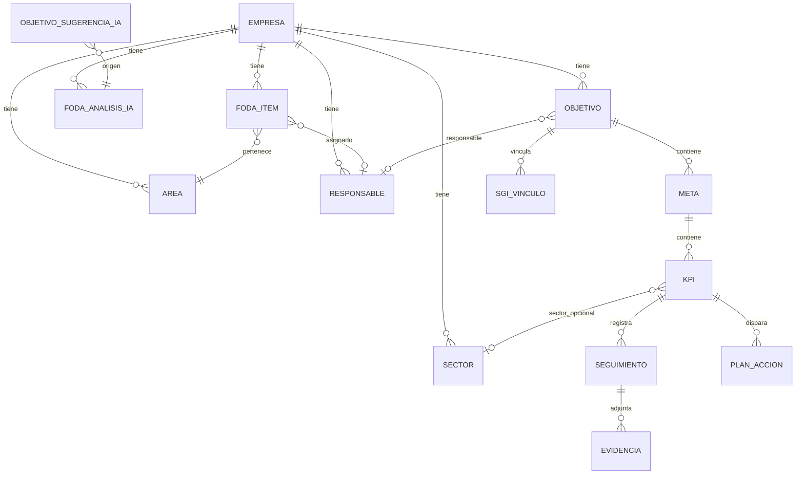

# 4. Modelo de datos (normalizado)

## 4.1 Diagrama entidad-relación



## 4.2 Catálogos y configuración

### `empresas`

| Columna | Tipo | Notas |
|---------|------|-------|
| id | INTEGER PK | |
| nombre | VARCHAR(200) | |
| activa | BOOLEAN | |

### `sectores`

| Columna | Tipo | Notas |
|---------|------|-------|
| id | INTEGER PK | |
| empresa_id | FK empresas | INDEX |
| codigo | VARCHAR(20) | UNIQUE (empresa_id, codigo) |
| nombre | VARCHAR(100) | |
| activo | BOOLEAN | |

### `areas`

| Columna | Tipo | Notas |
|---------|------|-------|
| id | INTEGER PK | |
| empresa_id | FK | |
| sector_id | FK sectores NULL | |
| codigo | VARCHAR(20) | |
| nombre | VARCHAR(100) | |

### `responsables`

| Columna | Tipo | Notas |
|---------|------|-------|
| id | INTEGER PK | |
| empresa_id | FK | |
| codigo | VARCHAR(20) | |
| nombre | VARCHAR(150) | |
| email | VARCHAR(150) NULL | |
| area_id | FK areas NULL | |
| activo | BOOLEAN | |

### `planeamiento_config`

| Columna | Tipo | Notas |
|---------|------|-------|
| id | INTEGER PK | |
| empresa_id | FK UNIQUE | |
| umbral_verde | DECIMAL(5,2) | Default 90 |
| umbral_amarillo | DECIMAL(5,2) | Default 70 |
| periodo_seguimiento_default | VARCHAR(20) | mensual |
| auto_plan_accion | BOOLEAN | Default true |
| openai_model_override | VARCHAR(50) NULL | |

## 4.3 FODA

### `foda_items`

Unifica Fortalezas, Oportunidades, Debilidades, Amenazas con discriminador `tipo`.

| Columna | Tipo | Notas |
|---------|------|-------|
| id | INTEGER PK | |
| empresa_id | FK | INDEX |
| tipo | ENUM('F','O','D','A') | Fortaleza, Oportunidad, Debilidad, Amenaza |
| codigo | VARCHAR(30) | Ej. F-001 |
| descripcion | TEXT | |
| area_id | FK areas | |
| responsable_id | FK responsables NULL | |
| fecha | DATE | |
| activo | BOOLEAN | Soft delete = false |
| created_at | DATETIME | |
| updated_at | DATETIME | |

**Índices:** `(empresa_id, tipo)`, `(empresa_id, codigo)` UNIQUE.

### `foda_analisis_ia`

| Columna | Tipo | Notas |
|---------|------|-------|
| id | INTEGER PK | |
| empresa_id | FK | |
| hash_foda_snapshot | VARCHAR(64) | SHA256 del JSON entrada |
| cruces_fo | JSON/TEXT | Lista estrategias FO |
| cruces_do | JSON | |
| cruces_fa | JSON | |
| cruces_da | JSON | |
| situacion_actual | TEXT | |
| riesgos | TEXT | |
| oportunidades | TEXT | |
| recomendaciones | TEXT | |
| informe_completo_md | TEXT | Markdown renderizable |
| model | VARCHAR(50) | |
| prompt_version | VARCHAR(20) | |
| created_at | DATETIME | |

## 4.4 Objetivos estratégicos

### `objetivos`

| Columna | Tipo | Notas |
|---------|------|-------|
| id | INTEGER PK | |
| empresa_id | FK | |
| codigo | VARCHAR(30) | OBJ-001 |
| nombre | VARCHAR(200) | |
| descripcion | TEXT | |
| categoria | VARCHAR(80) | ventas, costos, etc. |
| responsable_id | FK | |
| fecha_inicio | DATE | |
| fecha_fin | DATE | |
| estado | ENUM | borrador, activo, en_revision, finalizado |
| origen | ENUM('manual','ia') | |
| sugerencia_ia_id | FK NULL | |
| foda_analisis_id | FK NULL | Trazabilidad |
| activo | BOOLEAN | |
| created_at, updated_at | DATETIME | |

### `objetivos_sugerencias_ia`

Borrador hasta aceptar → copia a `objetivos`.

| Columna | Tipo | Notas |
|---------|------|-------|
| id | INTEGER PK | |
| empresa_id | FK | |
| foda_analisis_id | FK | |
| codigo_sugerido | VARCHAR(30) | |
| nombre | VARCHAR(200) | |
| descripcion | TEXT | |
| categoria | VARCHAR(80) | |
| estado | ENUM | pendiente, aceptada, rechazada, editada |
| payload_json | JSON | Campos extra IA |
| created_at | DATETIME | |

## 4.5 Metas

### `metas`

| Columna | Tipo | Notas |
|---------|------|-------|
| id | INTEGER PK | |
| empresa_id | FK | |
| objetivo_id | FK objetivos | INDEX |
| codigo | VARCHAR(30) | MET-001 |
| nombre | VARCHAR(250) | Texto de la meta |
| valor_objetivo | DECIMAL(18,4) | |
| unidad | VARCHAR(40) | %, USD, unidades |
| fecha_inicio | DATE | |
| fecha_fin | DATE | |
| responsable_id | FK | |
| activo | BOOLEAN | |
| origen | ENUM('manual','ia') | |
| created_at, updated_at | DATETIME | |

## 4.6 KPI

### `kpis`

| Columna | Tipo | Notas |
|---------|------|-------|
| id | INTEGER PK | |
| empresa_id | FK | |
| meta_id | FK metas | INDEX |
| codigo | VARCHAR(30) | KPI-001 |
| nombre | VARCHAR(200) | |
| formula | VARCHAR(500) | Texto + tipo plantilla |
| formula_tipo | ENUM | ratio, suma, custom_v2 |
| unidad | VARCHAR(40) | |
| frecuencia | ENUM | diario, semanal, mensual, trimestral, anual |
| valor_objetivo | DECIMAL(18,4) | |
| responsable_id | FK | |
| sector_id | FK NULL | Para dashboard por sector |
| tipo_agregacion | ENUM | ultimo, promedio, suma |
| activo | BOOLEAN | |
| created_at, updated_at | DATETIME | |

## 4.7 Seguimiento

### `seguimientos`

| Columna | Tipo | Notas |
|---------|------|-------|
| id | INTEGER PK | |
| empresa_id | FK | |
| kpi_id | FK kpis | INDEX |
| fecha | DATE | Período del registro |
| valor_real | DECIMAL(18,4) | |
| observaciones | TEXT NULL | |
| avance_mensual_pct | DECIMAL(8,2) | Calculado |
| avance_acumulado_pct | DECIMAL(8,2) | Calculado |
| desvio | DECIMAL(18,4) | Calculado |
| tendencia | ENUM | sube, baja, estable |
| cumplimiento_pct | DECIMAL(8,2) | Para semáforo |
| created_by | VARCHAR(100) NULL | Usuario sesión |
| created_at | DATETIME | |

**Índice UNIQUE:** `(kpi_id, fecha)` para evitar duplicados del mismo período.

### `evidencias`

| Columna | Tipo | Notas |
|---------|------|-------|
| id | INTEGER PK | |
| empresa_id | FK | |
| seguimiento_id | FK seguimientos | |
| nombre_archivo | VARCHAR(255) | |
| ruta_almacenamiento | VARCHAR(500) | Relativo a storage/ |
| mime_type | VARCHAR(100) | |
| tamano_bytes | INTEGER | |
| uploaded_at | DATETIME | |

## 4.8 Planes de acción

### `planes_accion`

| Columna | Tipo | Notas |
|---------|------|-------|
| id | INTEGER PK | |
| empresa_id | FK | |
| kpi_id | FK kpis | |
| seguimiento_id | FK NULL | Origen del incumplimiento |
| accion | TEXT | |
| responsable_id | FK | |
| fecha_compromiso | DATE | |
| estado | ENUM | pendiente, en_proceso, completado, cancelado |
| comentarios | TEXT NULL | |
| auto_generado | BOOLEAN | |
| created_at, updated_at | DATETIME | |

**Regla:** al guardar seguimiento con `cumplimiento_pct < umbral_amarillo` y `auto_plan_accion=true`, insertar plan si no existe uno pendiente para ese KPI.

## 4.9 Integración SGI

### `sgi_vinculos`

| Columna | Tipo | Notas |
|---------|------|-------|
| id | INTEGER PK | |
| empresa_id | FK | |
| objetivo_id | FK objetivos | |
| meta_id | FK NULL | Opcional granularidad |
| kpi_id | FK NULL | |
| tipo_entidad | VARCHAR(50) | riesgo, no_conformidad, ... |
| entidad_externa_id | VARCHAR(50) | ID en sistema externo |
| titulo_cache | VARCHAR(250) | Para UI sin join cross-DB |
| url_detalle | VARCHAR(500) NULL | |
| created_at | DATETIME | |

**Índice:** `(objetivo_id, tipo_entidad, entidad_externa_id)` UNIQUE.

## 4.10 IA — Predicciones y alertas

### `predicciones_ia`

| Columna | Tipo | Notas |
|---------|------|-------|
| id | INTEGER PK | |
| empresa_id | FK | |
| objetivo_id | FK NULL | NULL = global |
| kpi_id | FK NULL | |
| probabilidad_cumplimiento | DECIMAL(5,2) | 0-100 |
| riesgo_incumplimiento | ENUM | bajo, medio, alto |
| es_critico | BOOLEAN | |
| recomendacion_texto | TEXT | |
| payload_json | JSON | Detalle IA |
| model | VARCHAR(50) | |
| calculado_at | DATETIME | |

### `alertas`

| Columna | Tipo | Notas |
|---------|------|-------|
| id | INTEGER PK | |
| empresa_id | FK | |
| tipo | VARCHAR(40) | kpi_critico, objetivo_riesgo, plan_vencido |
| referencia_tipo | VARCHAR(30) | kpi, objetivo, plan |
| referencia_id | INTEGER | |
| mensaje | TEXT | |
| leida | BOOLEAN | |
| created_at | DATETIME | |

## 4.11 Auditoría

### `auditoria_eventos`

| Columna | Tipo | Notas |
|---------|------|-------|
| id | INTEGER PK | |
| empresa_id | FK | |
| usuario | VARCHAR(100) | |
| entidad | VARCHAR(50) | |
| entidad_id | INTEGER | |
| accion | VARCHAR(30) | create, update, delete, ia_run |
| detalle_json | JSON | |
| created_at | DATETIME | |

## 4.12 Vistas materializadas (PostgreSQL, fase 3)

- `vw_dashboard_cumplimiento_objetivo`
- `vw_kpi_ultimo_seguimiento`

En SQLite: consultas equivalentes en `dashboard_service`.

## 4.13 Generación de códigos

| Entidad | Patrón | Ejemplo |
|---------|--------|---------|
| FODA F | `F-{seq:03}` | F-001 |
| FODA O | `O-{seq:03}` | O-001 |
| Objetivo | `OBJ-{seq:03}` | OBJ-001 |
| Meta | `MET-{seq:03}` | MET-001 |
| KPI | `KPI-{seq:03}` | KPI-001 |

Secuencia por `(empresa_id, tipo)` en tabla `codigo_secuencias`.

## 4.14 Script SQL inicial (referencia)

```sql
-- Ejemplo simplificado FODA (SQLite)
CREATE TABLE foda_items (
    id INTEGER PRIMARY KEY AUTOINCREMENT,
    empresa_id INTEGER NOT NULL,
    tipo TEXT NOT NULL CHECK (tipo IN ('F','O','D','A')),
    codigo TEXT NOT NULL,
    descripcion TEXT NOT NULL,
    area_id INTEGER NOT NULL,
    responsable_id INTEGER,
    fecha DATE NOT NULL,
    activo INTEGER DEFAULT 1,
    created_at TEXT DEFAULT CURRENT_TIMESTAMP,
    updated_at TEXT DEFAULT CURRENT_TIMESTAMP,
    UNIQUE (empresa_id, codigo)
);
```

El modelo completo se generará vía **Alembic** en Etapa 1 del plan de desarrollo.
