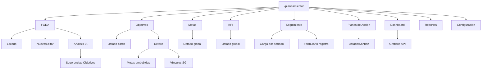
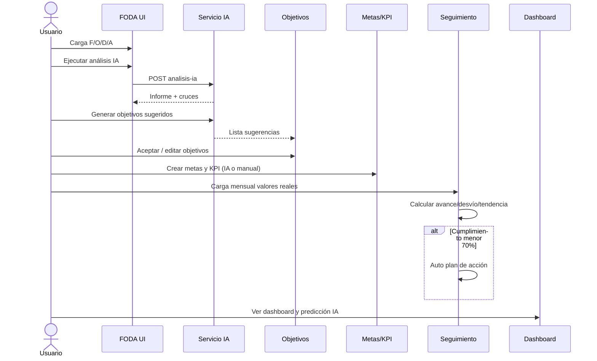
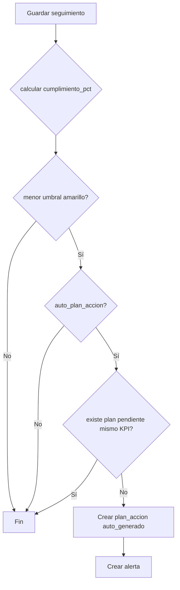

# 6. Flujo de navegación y rutas

## 6.1 Mapa del menú principal

## 6.2 Tabla de rutas HTML

| # | Sección | Método | Ruta | Template |
|---|---------|--------|------|----------|
| 0 | Home | GET | `/planeamiento/` | redirect → dashboard |
| 1 | Dashboard | GET | `/planeamiento/dashboard/` | `dashboard/index.html` |
| 2 | FODA list | GET | `/planeamiento/foda/` | `foda/list.html` |
| 2 | FODA new | GET | `/planeamiento/foda/nuevo` | `foda/form.html` |
| 2 | FODA edit | GET | `/planeamiento/foda/<id>/editar` | `foda/form.html` |
| 2 | FODA análisis | GET | `/planeamiento/foda/analisis` | `foda/analisis_ia.html` |
| 3 | Objetivos | GET | `/planeamiento/objetivos/` | `objetivos/list.html` |
| 3 | Objetivo detalle | GET | `/planeamiento/objetivos/<id>` | `objetivos/detail.html` |
| 3 | Sugerencias IA | GET | `/planeamiento/objetivos/sugerencias` | `objetivos/sugerencias.html` |
| 4 | Metas | GET | `/planeamiento/metas/` | `metas/list.html` |
| 5 | KPI | GET | `/planeamiento/kpis/` | `kpis/list.html` |
| 6 | Seguimiento | GET | `/planeamiento/seguimiento/` | `seguimiento/list.html` |
| 7 | Planes | GET | `/planeamiento/planes-accion/` | `planes_accion/list.html` |
| 8 | Reportes | GET | `/planeamiento/reportes/` | `reportes/index.html` |
| 9 | Config | GET | `/planeamiento/configuracion/` | `configuracion/index.html` |

## 6.3 API REST (AJAX)

| Método | Ruta | Acción |
|--------|------|--------|
| GET | `/planeamiento/api/v1/foda/items` | Listar con filtros |
| POST | `/planeamiento/api/v1/foda/items` | Crear |
| PUT | `/planeamiento/api/v1/foda/items/<id>` | Actualizar |
| DELETE | `/planeamiento/api/v1/foda/items/<id>` | Soft delete |
| GET | `/planeamiento/api/v1/foda/export.xlsx` | Excel |
| GET | `/planeamiento/api/v1/foda/export.pdf` | PDF |
| POST | `/planeamiento/api/v1/foda/analisis-ia` | Ejecutar IA |
| GET | `/planeamiento/api/v1/foda/analisis-ia/latest` | Último informe |
| GET/POST | `/planeamiento/api/v1/objetivos` | CRUD |
| POST | `/planeamiento/api/v1/objetivos/sugerencias/<id>/aceptar` | Aceptar IA |
| GET/POST | `/planeamiento/api/v1/objetivos/<oid>/metas` | Metas anidadas |
| GET/POST | `/planeamiento/api/v1/metas/<mid>/kpis` | KPI anidados |
| POST | `/planeamiento/api/v1/seguimientos` | Cargar + calcular |
| GET | `/planeamiento/api/v1/dashboard/resumen` | KPIs tarjetas |
| GET | `/planeamiento/api/v1/dashboard/grafico/<tipo>` | Series Plotly |
| POST | `/planeamiento/api/v1/ia/prediccion` | Predicción |
| GET | `/planeamiento/api/v1/alertas` | Alertas activas |
| GET/POST/DELETE | `/planeamiento/api/v1/sgi/vinculos` | Vínculos |
| GET/POST | `/planeamiento/api/v1/planes-accion` | CRUD planes |

## 6.4 Flujo de usuario principal (happy path)

## 6.5 Flujo de decisión — Plan de acción automático

## 6.6 Breadcrumbs

| Pantalla | Breadcrumb |
|----------|------------|
| FODA editar | Planeamiento > FODA > Editar F-001 |
| Objetivo detalle | Planeamiento > Objetivos > OBJ-001 |
| Metas (filtro objetivo) | Planeamiento > Objetivos > OBJ-001 > Metas |
| Seguimiento | Planeamiento > Seguimiento > Marzo 2026 |

## 6.7 Permisos (roles propios de la app)

| Rol | FODA | Objetivos | Seguimiento | Dashboard | Config |
|-----|------|-----------|-------------|-----------|--------|
| Admin | RW | RW | RW | R | RW |
| Gerente | R | RW | R | R | R |
| Responsable área | RW propio | RW propio | RW propio | R filtrado | - |
| Consulta | R | R | R | R | - |

Implementación: Flask-Login + tabla `usuarios` / `roles`; decoradores `@requiere_rol('admin')`.

## 6.8 Deep links desde otros módulos SGI

Ejemplo desde No Conformidad:

`/planeamiento/objetivos/12?vinculo=nc&entidad_id=NC-2026-004`

Abre tab Vínculos SGI con modal prellenado.
