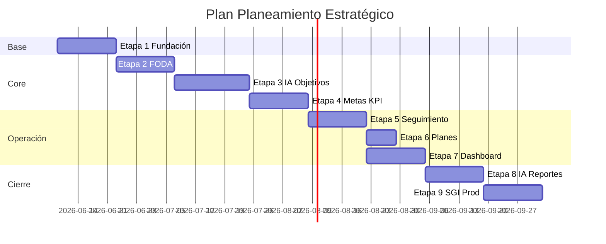

# 7. Plan de desarrollo por etapas

## 7.1 Resumen ejecutivo

| Etapa | Nombre | Duración estimada | Entregable principal |
|-------|--------|-------------------|----------------------|
| 0 | Diseño | 1 semana | Documentación (este paquete) ✓ |
| 1 | Fundación | 2 semanas | App Flask, DB, layout, catálogos |
| 2 | FODA + export | 2 semanas | CRUD FODA, Excel/PDF |
| 3 | IA FODA + objetivos | 2–3 semanas | Análisis IA, sugerencias, CRUD objetivos |
| 4 | Metas y KPI | 2 semanas | Jerarquía completa, fórmulas básicas |
| 5 | Seguimiento y cálculos | 2 semanas | Carga mensual, evidencias, métricas |
| 6 | Planes + alertas | 1 semana | Auto planes, bandeja alertas |
| 7 | Dashboard | 2 semanas | Plotly/Chart.js, semáforos |
| 8 | Predicción IA + reportes | 2 semanas | Predicciones, PDF ejecutivo |
| 9 | SGI + hardening | 2 semanas | Vínculos, permisos, PostgreSQL, tests |

**Total estimado:** 16–18 semanas (1 dev full-time) o 8–10 semanas (2 devs en paralelo etapas 2–4).

---

## 7.2 Etapa 0 — Diseño (actual)

**Objetivo:** Alinear arquitectura antes de código.

**Entregables:**

- [x] Visión y alcance
- [x] Arquitectura técnica
- [x] Estructura de carpetas
- [x] Modelo de datos
- [x] Wireframes
- [x] Flujo de navegación
- [x] Plan por etapas

**Criterio de salida:** Aprobación explícita del diseño por tu parte.

---

## 7.3 Etapa 1 — Fundación

**Objetivo:** Aplicación Flask ejecutable de forma autónoma.

**Tareas:**

1. `create_app()`, config, extensions (SQLAlchemy, Migrate, CSRF).
2. Migración Alembic inicial (catálogos + `planeamiento_config`).
3. Layout `base.html`: sidebar 9 ítems, tema claro/oscuro, responsive.
4. Blueprint `main` + redirect a dashboard placeholder.
5. CRUD API + UI para **Sectores, Áreas, Responsables** en Configuración.
6. Seed demo (`scripts/seed_demo.py`).
7. Tests: app factory, health check.

**Criterios de aceptación:**

- `flask run` levanta módulo en `/planeamiento/`.
- Tema persiste en `localStorage`.
- SQLite creado con migraciones reproducibles.

---

## 7.4 Etapa 2 — Módulo FODA

**Tareas:**

1. Modelo `foda_items`, generador códigos F/O/D/A.
2. UI tabs por cuadrante, filtros, búsqueda.
3. API CRUD + validaciones.
4. `export_service`: Excel (openpyxl), PDF (plantilla matriz).
5. Auditoría en create/update/delete.

**Criterios:**

- Crear/editar/eliminar/buscar/filtrar según spec.
- Export descargable con columnas: código, descripción, área, responsable, fecha.

---

## 7.5 Etapa 3 — Análisis IA FODA + Objetivos

**Tareas:**

1. `foda_ia_service` + prompts YAML (cruces FO/DO/FA/DA).
2. Pantalla análisis con secciones del informe.
3. Cache por hash snapshot FODA.
4. Modelos `objetivos`, `objetivos_sugerencias_ia`.
5. Flujo aceptar / rechazar / editar sugerencias.
6. CRUD objetivos manual, estados (borrador → activo → …).
7. Modo demo IA sin API key.

**Criterios:**

- Informe incluye: situación, riesgos, oportunidades, recomendaciones.
- Objetivos aceptados persisten con trazabilidad `foda_analisis_id`.

**Riesgos:** costo API → rate limit + cache.

---

## 7.6 Etapa 4 — Metas y KPI

**Tareas:**

1. Modelos `metas`, `kpis` con relaciones.
2. UI listado global y embebido en detalle objetivo.
3. Sugerencia IA metas/KPI (prompt secundario).
4. `kpi_calculator` v1 (ratio, avance %).
5. Validación fechas (inicio &lt; fin, dentro de objetivo).

**Criterios:**

- Múltiples metas por objetivo; múltiples KPI por meta.
- Frecuencias: diario … anual.

---

## 7.7 Etapa 5 — Seguimiento mensual

**Tareas:**

1. Modelos `seguimientos`, `evidencias`, upload seguro.
2. UI grilla por período + modal carga.
3. Cálculo automático: avance mensual, acumulado, desvío, tendencia.
4. UNIQUE (kpi_id, fecha).
5. Import masivo Excel (opcional fin de etapa).

**Criterios:**

- Al guardar, métricas visibles sin recargar página completa (AJAX).
- Evidencia adjunta descargable con permiso.

---

## 7.8 Etapa 6 — Planes de acción

**Tareas:**

1. Modelo `planes_accion`, hook post-seguimiento.
2. UI listado con filtros estado/responsable/KPI.
3. Modelo `alertas` + badge en topbar.
4. Notificación visual en dashboard (sin email en v1).

**Criterios:**

- KPI &lt; 70% (configurable) genera plan si no hay pendiente.
- Estados: pendiente, en proceso, completado, cancelado.

---

## 7.9 Etapa 7 — Dashboard ejecutivo

**Tareas:**

1. `dashboard_service` agregaciones SQL.
2. API `/dashboard/resumen` y `/dashboard/grafico/{tipo}`.
3. Tarjetas: objetivos/metas/KPI activos, cumplimiento global.
4. Gráficos: por objetivo, sector, responsable, evolución mensual, anual.
5. Componente semáforo (verde/amarillo/rojo).
6. Plotly para barras/líneas; Chart.js para donut global.

**Criterios:**

- Umbrales 90/70/% aplicados consistentemente con config.
- Responsive en tablet.

---

## 7.10 Etapa 8 — Predicción IA y reportes

**Tareas:**

1. `prediccion_ia_service` con histórico seguimientos.
2. Panel dashboard + detalle objetivo.
3. Generación texto recomendación (ejemplo spec).
4. Módulo reportes: wizard PDF informe ejecutivo.
5. Registro `predicciones_ia` versionado.

**Criterios:**

- Predicción muestra probabilidad % y KPI críticos listados.
- Reporte PDF incluye FODA resumen + cumplimiento período.

---

## 7.11 Etapa 9 — Integración SGI y producción

**Tareas:**

1. `sgi_vinculos` + UI tab en objetivo.
2. `sgi_adapter` genérico (URLs configurables; sin acoplamiento a productos concretos).
3. Soporte PostgreSQL en `config.Production`.
4. Suite tests integración (calculator, dashboard, FODA API).
5. Documentación despliegue (`docs/deploy.md`).
6. Revisión seguridad: CSRF, uploads, SQL injection ORM.

**Criterios:**

- Cambiar `DATABASE_URL` a PostgreSQL sin cambios de código.
- Al menos 1 vínculo demo NC ↔ objetivo funcional.

---

## 7.12 Paralelización sugerida

Etapa 7 puede iniciar en paralelo con Etapa 6 tras tener seguimientos de prueba.

---

## 7.13 MVP (mínimo viable comercial)

Para demo temprana (8 semanas):

1. Etapas 1–2 completas (FODA + export).
2. Etapa 3 sin IA real (fixtures) + objetivos manuales.
3. Etapa 4–5 simplificadas.
4. Dashboard básico (Etapa 7 reducida: solo tarjetas + 2 gráficos).

IA real y SGI en fase 2 del producto.

---

## 7.14 Checklist pre-codificación (gate)

Antes de `git init` / primera migración:

- [ ] Confirmar si los vínculos SGI son obligatorios en v1 o solo enlaces manuales.
- [ ] Confirmar versión Python y política de secrets (`.env`).
- [ ] Aprobar modelo de datos (cambios de columnas aquí son baratos).
- [ ] Aprobar wireframes dashboard y FODA.
- [ ] Definir credenciales OpenAI y presupuesto mensual IA.
- [ ] Listar módulos SGI prioritarios para vínculos (orden etapa 9).

---

## 7.15 Próximo paso inmediato

Tras tu aprobación del diseño, la **Etapa 1** generará:

- Estructura de carpetas real (`app/`, `static/`, `migrations/`).
- `requirements.txt` y `.env.example`.
- Migración inicial y layout navegable con las 9 secciones (placeholders).

Indica si prefieres **MVP acelerado** o **implementación completa por etapas** para comenzar la Etapa 1 en este repositorio.
