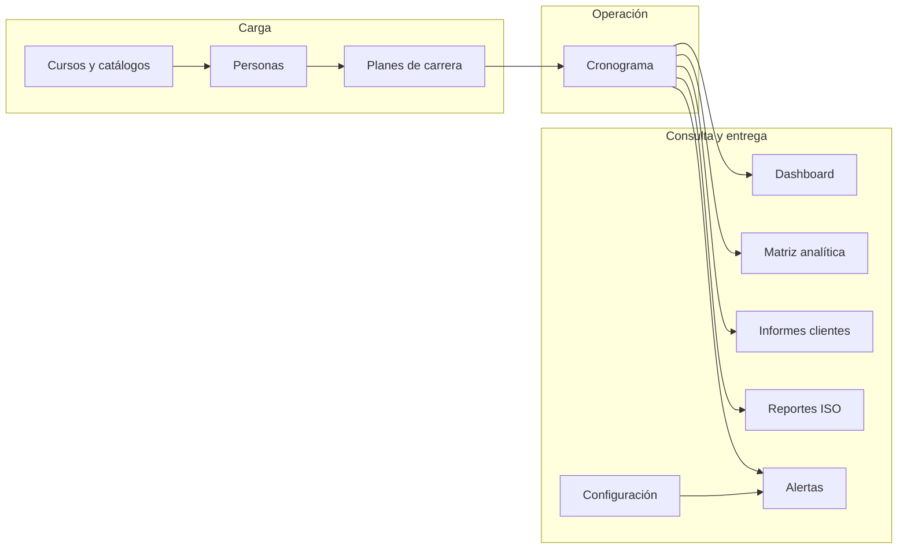
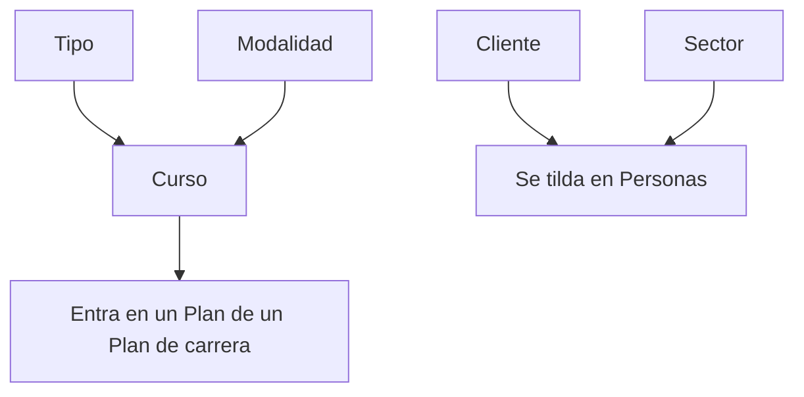
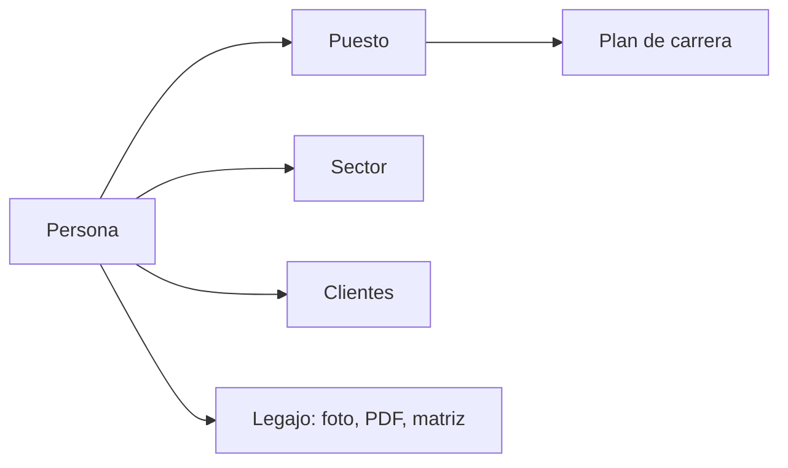
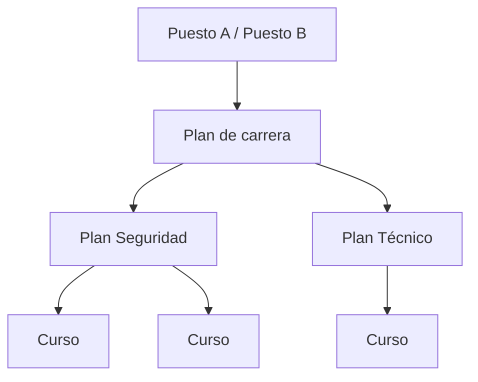
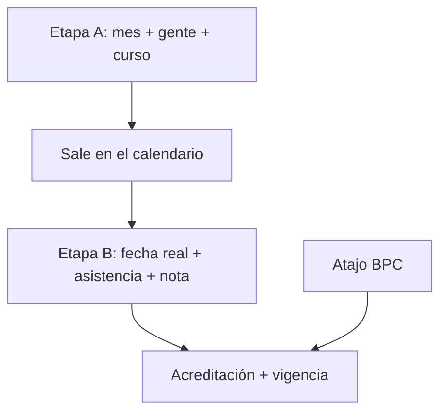

# Capacitación GOS — guía módulo por módulo

Ruta: `/gos/capacitacion/` (menú izquierdo).  
Los datos están en tablas `cap_*`. Un push de código no cambia personas ni cursos. En Render, Capacitación está **blindada** al subir un backup (salvo `--allow-cap-overwrite`).

**Idea central.** El **puesto** define qué debe saber la persona. El **plan de carrera** lista los cursos. El **cronograma** dice cuándo se dictan. Al **cerrar asistencia**, el sistema acredita, calcula vigencia y alimenta dashboard, matriz, alertas e informes.

Diagrama editable: [`capacitacion-flujo.drawio`](capacitacion-flujo.drawio) (una hoja por pantalla). Vista previa del flujo en [mermaid.live](https://mermaid.live).

---

## Mapa de pantallas

| Orden sugerido | Pantalla | Para qué |
|----------------|----------|----------|
| 1 | Cursos y catálogos | Maestro: cursos, tipos, clientes, sectores |
| 2 | Personas | Quién es quién: puesto, sector, clientes |
| 3 | Planes de carrera | Qué debe hacer cada puesto |
| 4 | Cronograma | Programar y cerrar dictados |
| 5 | Dashboard | Estado del mes y habilitación |
| 6 | Matriz analítica | Números por mes / persona / plan |
| 7 | Informes clientes | Documento para un cliente |
| 8 | Reportes ISO | Auditoría 9001 / 14001 / 45001 |
| 9 | Alertas | Vencidos y pendientes |
| 10 | Configuración | Umbrales, mails, logo |

Buscador global (arriba): personas, cursos y planes de carrera. Salta a la pantalla correspondiente.

---

## 1. Cursos y catálogos

**URL:** `/gos/capacitacion/catalogos`  
**Para qué:** armar el maestro. Sin cursos y clientes el resto no se puede usar bien.

### 1.1 Cursos

- **Agregar:** código, nombre, descripción, **tipo**, **modalidad**, horas.
- **Requiere evaluación:** si está tildado, hay que cargar **puntaje mínimo**. Al cerrar el cronograma, aprueba quien asista **y** tenga nota ≥ mínimo.
- **Tiene fecha de vencimiento:** elegir período (meses). Al dictarse, el sistema puede reprogramar al **día hábil anterior** al vencimiento.
- **Importar Excel** para altas masivas.
- **Dar de baja** deja el curso inactivo (no lo borra de históricos).
- Si el nombre se parece a uno existente, aparece **Registro similar**: usar el existente o crear igual.

### 1.2 Clasificación de cursos

Dos listas independientes: **Tipo** y **Modalidad**.  
Al crear un curso combinás un tipo + una modalidad. Se pueden agregar ítems con el `+` de cada columna.

### 1.3 Clientes

Empresas a las que se **afecta** personal (no son las empresas capacitadoras externas).  
Una persona puede estar en más de un cliente.  
Se puede subir **logo** (sale en Informes clientes). Código opcional.

### 1.4 Sectores

Código + nombre. Se usan en Personas, Dashboard (cumplimiento por sector) e informes.

### Relación con otras pantallas

Los **puestos** y **centros** se crean al vuelo en Personas (`+` al lado del combo), no en esta pantalla.  
Las **empresas capacitadoras** (quién dicta un curso externo) se cargan al **cerrar el cronograma**, no acá.

---

## 2. Personas

**URL:** `/gos/capacitacion/personas`  
**Para qué:** el padrón. El **puesto** es el gancho con el plan de carrera.

### Alta / edición

Campos: nombre\*, legajo\*, email, centro, sector, puesto, **empresas cliente** (varias).  
`+` al lado de centro, sector y puesto para crearlos sin salir del formulario.  
**Dar de baja** = inactivo (deja de contar en KPIs).  
**Importar** Excel.

Filtros: texto (nombre/legajo) y sector.

### Legajo (clic en la fila)

- Foto (subir / quitar).
- Datos de perfil.
- **Plan de carrera del puesto:** qué planes y cursos le corresponden. Si no hay puesto o el puesto no tiene plan, lo dice explícito.
- Atajo **Matriz** (abre matriz filtrada a esa persona).
- **PDF** individual.
- **Editar**.

Sin puesto asignado, esa persona **no entra** a los planes de carrera ni aparece al programar por puesto (salvo “mostrar todas”).

---

## 3. Planes de carrera

**URL:** `/gos/capacitacion/programas`  
**Estructura:** `Puesto → Plan de carrera → Plan → Cursos`

### Crear

1. **Puestos que aplican** (uno o más). El mismo plan puede servir a varios puestos.
2. **Nombre** del plan de carrera (lista + `+` para uno nuevo).
3. **Tipo:** interno o externo. Si es externo, la empresa que lo dicta se indica **al cerrar el cronograma**, no acá.
4. **Planes** (bloques: Seguridad, Técnico, etc.). Varios tags.
5. Código (opcional; se genera solo) y descripción.

### Lista

Filtro por puesto(s) y por tipo interno/externo.  
Clic en una tarjeta: ver planes y **agregar o quitar cursos** de cada plan.  
**Plantilla** Excel + **Importar Excel**: crea o completa **sin borrar** lo ya cargado.

Lo que cuelga acá es lo que el analítico y las alertas tratan como **requerido** para ese puesto.

---

## 4. Cronograma

**URL:** `/gos/capacitacion/cronograma`  
Dos pestañas: **Calendario** y **Resumen mensual** (mismos filtros que la matriz: puesto, persona, plan, tipo, empresa, curso).  
Botón **Programar**.

### 4.1 Etapa A — Planificación

Cada paso habilita el siguiente:

1. Puestos convocados.
2. Plan de carrera (solo los que aplican a esos puestos).
3. Tipo (interno / externo).
4. Plan (bloque).
5. Personas a capacitar (las del puesto; se puede “mostrar todas”).
6. Curso (los del plan elegido).
7. **Mes** programado (el día exacto se carga en el cierre).
8. Capacitador, lugar, link virtual.

**Guardar cronograma** deja el encuentro en estado programado. Todavía **no** acredita.

### 4.2 Acciones sobre un evento

Clic en el calendario → **Modificar** / **Registrar asistencia** / **Eliminar**.

### 4.3 Etapa B — Cierre

- Fecha de realización\*, capacitador final, lugar, link.
- Si el plan es **externo:** empresa capacitadora\* (se puede dar de alta ahí).
- PDFs: material de capacitación y resultados del examen.
- Por persona: ¿asistió? y nota.
- El estado (Aprobó / No aprobó / No asistió) **se calcula** con las reglas del curso.
- **Cerrar cronograma** genera registro, vigencia y **acreditación** en todos los planes del puesto donde aparece ese curso.

### 4.4 Buenas prácticas compartidas (BPC)

Casilla al programar. Charla suelta: personas, nombre, fecha, capacitador, archivos (PDF/foto).  
Se acredita como **complementaria** en la matriz, **sin** plan de carrera.

---

## 5. Dashboard

**URL:** `/gos/capacitacion/`  
**Para qué:** foto del mes. No se carga nada acá.

### KPIs

Personas activas, cursos cargados, realizadas (mes), pendientes, vencidas, % cumplimiento, horas hombre (mes), tasa de aprobación.

### Recursos

Lista de personas con estado.  
**Habilitados / no habilitados:** inhabilita solo un curso **programado** desaprobado o no hecho en tiempo y forma. Un curso del plan **aún no programado** no inhabilita. Estar inscripto en un encuentro que todavía no se dictó tampoco.

### Widgets

Calendario (mes / semana / día), cumplimiento por sector, evolución mensual, cumplimiento por tipo de curso.

---

## 6. Matriz analítica

**URL:** `/gos/capacitacion/matriz`  
Año + filtros (puesto, persona, plan, tipo, empresa externa, curso) + **Excel**.

| Pestaña | Qué muestra | Cómo usarla |
|---------|-------------|-------------|
| Resumen mensual | Por mes: programados, pendientes, cumplidos, puntuales, vencidos | Clic en una celda → detalle (quién / qué curso) |
| Tabla anual | Filas agrupadas por puesto, persona o plan; columnas por mes + anual | Igual: clic abre detalle |
| Por persona | Elegir legajo | Cursos y charlas BPC de esa persona |

Sirve para control de gestión; el cronograma sirve para cargar.

---

## 7. Informes clientes

**URL:** `/gos/capacitacion/informes`  
Elegir una tarjeta de cliente.

El documento usa las **personas afectadas a ese cliente** (tilde en Personas): KPIs, tabla (puesto, estado, cumplimiento, pendientes), donut de habilitación, sector y evolución.  
**Imprimir.** Logos: el de la empresa (Configuración) y el del cliente (Catálogos).

Si nadie está tildado en ese cliente, el informe sale vacío.

---

## 8. Reportes ISO

**URL:** `/gos/capacitacion/reportes`  
Pestañas **9001 / 14001 / 45001**. El sistema elige cursos según categoría/tipo y palabras en código o nombre (calidad, HSE, 45001, etc.).

Tabla: persona, legajo, sector, % cumplimiento, detalle.  
**Exportar PDF** de la norma y **Reporte general PDF**.

No reemplaza al informe de cliente; es recorte por norma.

---

## 9. Alertas

**URL:** `/gos/capacitacion/alertas`

| Botón | Efecto |
|-------|--------|
| Actualizar | Regenera alertas abiertas |
| Enviar email | Manda según Configuración |

Tipos típicos:

- Obligatoria pendiente (crítico).
- Capacitación vencida (crítico).
- Próxima a vencer (advertencia; umbral en Configuración).
- Encuentro programado cercano (días de aviso en Configuración).

Clic en la fila para marcar leída / ir al contexto. No “arregla” el dato: hay que programar, cerrar o recapacitar.

---

## 10. Configuración

**URL:** `/gos/capacitacion/configuracion`

| Campo | Uso |
|-------|-----|
| Días próximo a vencer | Alertas amarillas de vigencia |
| Días aviso encuentros | Aviso de cronograma próximo |
| % cumplimiento mínimo | Umbral de alerta de cumplimiento |
| Envío automático al actualizar | Mails al pulsar Actualizar en Alertas |
| Tipos de mail | Vencimientos, obligatorias pendientes, cursos programados |
| Destinatarios globales / por sector / por rol | Quién recibe |
| Logo empresa | Encabezado de informes a clientes |

---

## Reglas de negocio (todas las pantallas)

| Regla | Comportamiento |
|-------|----------------|
| Asistencia | No asistió → no aprueba. Asistió y el curso no pide evaluación → aprueba. |
| Evaluación | Nota ≥ puntaje mínimo del curso. |
| Vigencia | Fecha fin = aprobación + meses del curso (si tiene vencimiento). |
| Acreditación múltiple | Un curso aprobado se acredita en **todos** los planes de carrera del puesto donde está ese curso. |
| Habilitación | Solo cae por curso **programado** fallido o fuera de tiempo; no por huecos de catálogo. |
| Horas / fecha fin | Duración en días hábiles (bloques de 8 h) al calcular fin de dictado. |

---

## Atajos y datos

- Importar Excel: cursos, personas, planes de carrera (este último no pisa lo existente).
- Legajos se pueden alinear con el módulo Vacaciones (`sincronizar-vacaciones` en API; conviene tener el mismo número de legajo).
- Evidencias: foto de persona; PDF de certificado en registros; material y examen al cerrar; adjuntos BPC.
- Subir a Render: usar el flujo de backup / import; Capacitación no se pisa sola.

---

## Checklist de arranque (primera vez)

1. Catálogos: sectores, clientes (con logo si hay informes), tipos/modalidades, cursos (eval y vigencia).
2. Personas: alta o import; **asignar puesto** y clientes.
3. Planes de carrera: un plan por familia de puestos; cargar cursos en cada bloque.
4. Cronograma: programar el mes; después del dictado, cerrar asistencia.
5. Configuración: umbrales y mails.
6. Verificar Dashboard y Matriz; generar Alertas; probar un Informe de cliente.
